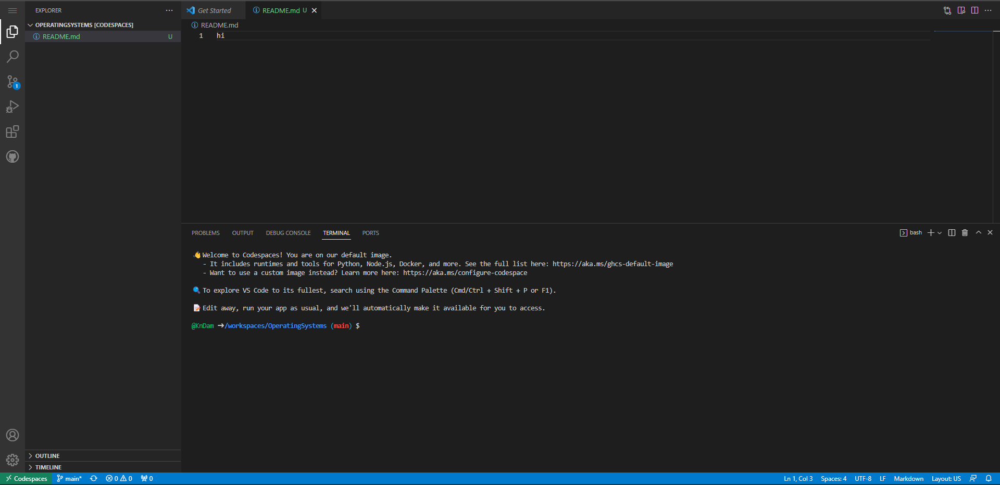

Operating Systems Yr1
  

  

  

  

## Redirecting ouput
### What Happens if you redirect to an existing file using >?
The file redirects the text in that file from "Hello World" to "Goodbye World"

### What is the difference between these two operators? (> >>)
Using ">" will overwrite the text to a new text while using ">>" will add a new line in the text file with the text you inputted.'

# LAB 7

  

  

  

  
